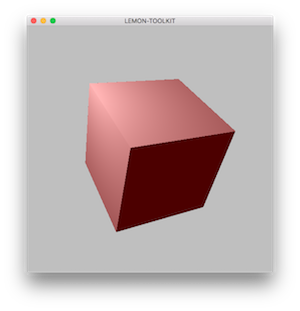

lemon-toolkit is an experimental purpose project, written with a minimalistic modular design philosophy, and built from the ground up to focus on cache friendly data layouts with entity-component based architecture.

its far from a stable version right now, but i'll keep on making it happens.

#### Screenshots

#### Thanks
1. [catch](https://github.com/philsquared/Catch): A modern, C++-native, header-only, framework for unit-tests;
1. [hayai](https://github.com/nickbruun/hayai): C++ benchmarking framework;
1. [stb](https://github.com/nothings/stb): stb single-file public domain libraries for C/C++;
